# Wazuh SOC Lab Installation Documentation

## Phase 1: GitHub Repository & Project Setup

**Date:** 11 July 2026

---

## Objective

Prepare the development environment and create a GitHub repository for documenting and managing the Wazuh SOC Lab project.

---

## Step 1: Create GitHub Repository

Repository Name:
```
wazuh-soc-lab
```

Visibility:
- Public

Status:
- Completed

---

## Step 2: Install Git

Installed Git for Windows.

Version:

```
git version 2.55.0.windows.2
```

Status:
- Completed

---

## Step 3: Install Visual Studio Code

Installed Visual Studio Code.

Purpose:

- Configuration Editing
- Documentation
- Git Integration

Status:
- Completed

---

## Step 4: Configure Git

Configured Username

```bash
git config --global user.name "Saymun Islam Sabuj"
```

Configured Email

```bash
git config --global user.email "saymunsabuj21766.1@gmail.com"
```

Status:
- Completed

---

## Step 5: Clone GitHub Repository

```bash
git clone https://github.com/saymunsabuj217661-byte/wazuh-soc-lab.git
```

Status:
- Completed

---

## Step 6: Create Project Structure

Created folders:

- agents
- architecture
- configs
- docs
- logs
- rsyslog
- screenshots
- scripts
- wazuh

Status:
- Completed

---

## Step 7: Create README

Created README.md file.

Status:
- Completed

---

## Step 8: Create .gitignore

Created .gitignore file.

Status:
- Completed

---

## Step 9: First Commit

```bash
git add .

git commit -m "Initial project structure"
```

Status:
- Completed

---

## Step 10: Push to GitHub

```bash
git push -u origin main
```

Status:
- Completed

---

## Verification

```bash
git status
```

Output:

```
On branch main

Your branch is up to date with 'origin/main'.

nothing to commit, working tree clean
```

Status:
- Successful

# Phase 2 - Ubuntu Server Preparation

## Objective

Prepare the Ubuntu Server virtual machine for Wazuh SIEM deployment.

## VM Configuration

- Hypervisor: VMware Workstation Pro
- VM Name: soc-server
- Operating System: Ubuntu Server 22.04.5 LTS
- RAM: 8 GB
- CPU: 4 vCPU
- Disk: 100 GB
- Network: NAT

## Static Network Configuration

- Interface: ens33
- IP Address: 192.168.10.132/24
- Gateway: 192.168.10.2
- DNS:
  - 8.8.8.8
  - 1.1.1.1

## Verification

Commands used:

```bash
hostnamectl
ip a
ip route
ping -c 4 8.8.8.8
ping -c 4 google.com
```

## Status

Completed

## Screenshots

### 1. VMware Virtual Machine Configuration


### 2. Network Configuration


### 3. Connectivity Test


### 4. System Information


# Phase 3 – Centralized Rsyslog Installation

## Objective

Install and verify the Rsyslog service to prepare the Ubuntu server for centralized log collection.

## Commands

```bash
sudo apt update
sudo apt install rsyslog -y
rsyslogd -v
sudo systemctl status rsyslog
sudo systemctl enable rsyslog
sudo systemctl is-enabled rsyslog
```

## Expected Result

- rsyslog installed successfully.
- Service status: active (running).
- Service enabled at boot.

## Screenshots


## Step 2: Backup Rsyslog Configuration

Before making any configuration changes, a backup of the original `rsyslog.conf` file was created.

### Command

```bash
sudo cp /etc/rsyslog.conf /etc/rsyslog.conf.backup
ls -l /etc/rsyslog.conf*
```

### Result

- Backup file created successfully.
- Original configuration remains unchanged.
- Backup can be restored if needed.

### Screenshot


## Step 3: Enable Remote Syslog Reception

The Rsyslog server was configured to receive remote logs using UDP and TCP protocols on port 514.

### Configuration

Enabled modules:

```conf
module(load="imudp")
input(type="imudp" port="514")

module(load="imtcp")
input(type="imtcp" port="514")
```

### Verification

```bash
grep -E "imudp|imtcp|514" /etc/rsyslog.conf

sudo systemctl restart rsyslog

sudo ss -tulnp | grep 514
```

### Expected Result

- UDP port 514 is listening.
- TCP port 514 is listening.
- Rsyslog service is active.

### Screenshots


## Step 4: Configure Remote Log Storage

A dedicated directory was created to store logs received by the centralized rsyslog server.

### Create Log Directory

```bash
sudo mkdir -p /var/log/remote
sudo chmod 755 /var/log/remote
```

### Configure Remote Log Template

File:

```bash
/etc/rsyslog.d/remote.conf
```

Configuration:

```conf
$template RemoteLogs,"/var/log/remote/%HOSTNAME%/%PROGRAMNAME%.log"

*.* ?RemoteLogs
& stop
```

### Permission Configuration

```bash
sudo chown -R syslog:adm /var/log/remote
sudo chmod -R 755 /var/log/remote
```

### Verification

```bash
sudo systemctl restart rsyslog

logger "Phase 3 remote log test"

sudo find /var/log/remote -type f
```

### Expected Result

- Rsyslog service running successfully.
- Remote log directory created.
- Logs stored based on hostname and program name.

### Screenshots


# Phase 4 - Wazuh Installation Preparation

## Objective

Prepare the Ubuntu Server environment before installing the Wazuh components.

---

## Step 1: Verify System Requirements

Before installing Wazuh, verify that the server meets the minimum hardware requirements.

### Commands

```bash
hostnamectl

free -h

nproc

df -h /
```

### Verification

- Operating System: Ubuntu Server 22.04.5 LTS
- Hostname verified.
- RAM: 8 GB
- CPU: 4 vCPU
- Root Filesystem: 97 GB

### Screenshot


---

## Step 2: Update Ubuntu Packages

Update the package index and ensure the operating system is fully updated.

### Commands

```bash
sudo apt update

sudo apt upgrade -y
```

### Result

- Package index updated successfully.
- No pending package upgrades.

### Screenshot


---

## Step 3: Verify Existing Rsyslog Configuration

Since the centralized rsyslog server was configured in Phase 3, verify that the service is still working correctly after the system update.

### Commands

```bash
sudo systemctl status rsyslog

sudo ss -tulnp | grep 514
```

### Expected Result

- rsyslog service is active (running).
- UDP port 514 is listening.
- TCP port 514 is listening.
- Previous rsyslog configuration remains unchanged.

### Screenshot


---

## Status

✅ Ubuntu Server is fully prepared for Wazuh installation.

The operating system has been updated successfully and the existing centralized rsyslog configuration remains operational.

# Phase 5 – Download Wazuh Installation Assistant

## Objective

Download and prepare the Wazuh installation assistant for deploying the Wazuh platform.

---

## Step 1: Download the Installation Assistant

### Command

```bash
cd ~

curl -sO https://packages.wazuh.com/4.14/wazuh-install.sh
```

### Result

The Wazuh installation assistant script was downloaded successfully.

### Screenshot


---

## Step 2: Verify Download

### Command

```bash
ls -lh wazuh-install.sh
```

### Result

Verified that the installation script exists.

### Screenshot


---

## Step 3: Make the Script Executable

### Commands

```bash
chmod +x wazuh-install.sh

ls -l wazuh-install.sh
```

### Result

Execution permission was successfully assigned.

### Screenshot


---

## Step 4: Verify the Installation Assistant

### Command

```bash
./wazuh-install.sh --help
```

### Result

The installation assistant displayed the available deployment options successfully.

### Screenshot


---

## Status

✅ Wazuh Installation Assistant downloaded and verified successfully.

# Phase 6 – Install Wazuh All-in-One

## Objective

Install the Wazuh platform (Indexer, Manager, Filebeat, and Dashboard) on a single Ubuntu Server.

---

## Step 1: Start Installation

### Command

```bash
cd ~

sudo bash ./wazuh-install.sh -a
```

### Result

The Wazuh installation assistant started the automatic deployment process.

### Screenshot


---

## Step 2: Installation Progress

The installation assistant automatically installed:

- Wazuh Indexer
- Wazuh Manager
- Filebeat
- Wazuh Dashboard
- SSL Certificates
- Security Configuration

### Screenshot


---

## Step 3: Installation Completed

### Result

The installation completed successfully, and the installer displayed the Wazuh Dashboard URL and default administrator credentials.

### Screenshot


---

## Status

✅ Wazuh platform installed successfully.
# Phase 7 – Verify Wazuh Installation

## Objective

Verify that all Wazuh components were installed successfully and are running properly.

---

## Step 1: Verify Wazuh Manager

### Command

```bash
sudo systemctl status wazuh-manager
```

### Expected Result

- Wazuh Manager service is active (running).

### Screenshot


---

## Step 2: Verify Wazuh Indexer

### Command

```bash
sudo systemctl status wazuh-indexer
```

### Expected Result

- Wazuh Indexer service is active (running).

### Screenshot


---

## Step 3: Verify Filebeat

### Command

```bash
sudo systemctl status filebeat
```

### Expected Result

- Filebeat service is active (running).

### Screenshot


---

## Step 4: Verify Wazuh Dashboard

### Command

```bash
sudo systemctl status wazuh-dashboard
```

### Expected Result

- Wazuh Dashboard service is active (running).

### Screenshot


---

## Step 5: Verify Listening Ports

### Command

```bash
sudo ss -tulnp | grep -E '1514|1515|514|55000|9200|443'
```

### Expected Result

The following ports should be listening:

| Port | Service |
|------|---------|
| 514 | Rsyslog |
| 1514 | Wazuh Agent Communication |
| 1515 | Wazuh Agent Registration |
| 55000 | Wazuh API |
| 9200 | Wazuh Indexer |
| 443 | Wazuh Dashboard |

### Screenshot


---

## Step 6: Verify Dashboard Login

Open a web browser and access:

```
https://<SERVER-IP>
```

Login using:

- Username: `admin`
- Password: Generated during installation

### Expected Result

The Wazuh Dashboard login page should load successfully.

### Screenshot


---

## Step 7: Verify Installed Wazuh Services

### Command

```bash
sudo systemctl --type=service | grep wazuh
```

### Expected Result

The installed Wazuh services should be displayed.

### Screenshot


---

## Verification Summary

| Component | Status |
|-----------|--------|
| Wazuh Manager | Running |
| Wazuh Indexer | Running |
| Filebeat | Running |
| Wazuh Dashboard | Running |
| Required Ports | Listening |
| Dashboard Access | Successful |

---

## Status

✅ Wazuh installation verified successfully.

# Phase 8 – Ubuntu Desktop Agent Preparation

## Objective

Prepare an Ubuntu Desktop virtual machine to act as a Wazuh Agent by verifying network connectivity, system configuration, and operating system readiness.

---

## VM Configuration

- Hypervisor: VMware Workstation Pro
- VM Name: ubuntu-agent
- Operating System: Ubuntu Desktop 22.04 LTS
- RAM: 4 GB
- CPU: 2 vCPU
- Disk: 20 GB
- Network: NAT

---

## Verification Commands

```bash
hostnamectl
ip a
ip route
ping -c 4 google.com
ping -c 4 192.168.10.132
sudo apt update
sudo apt upgrade -y
free -h
nproc
df -h
```

---

## Verification Results

- Ubuntu Desktop installed successfully.
- Network connectivity verified.
- Internet connectivity verified.
- Communication with the Wazuh server verified.
- System updated successfully.
- System resources verified.

---

## Screenshots

### 1. System Information

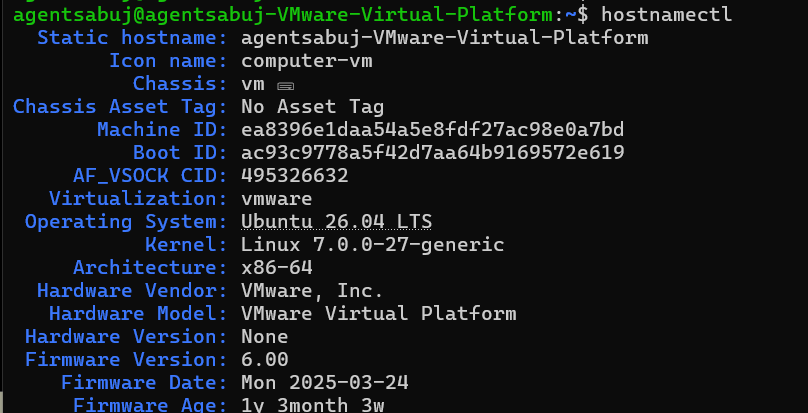

### 2. IP Address

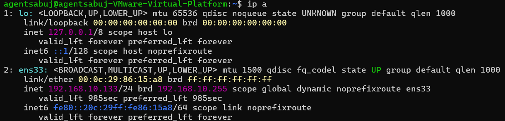

### 3. Routing Table

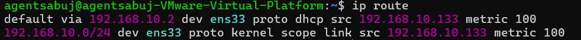

### 4. Internet Connectivity

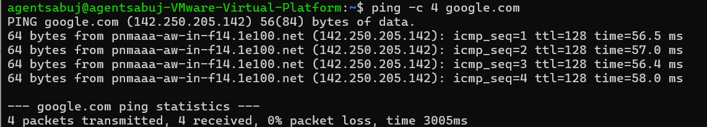

### 5. Wazuh Server Connectivity

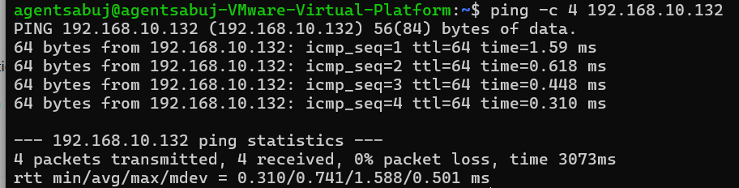

### 6. System Update

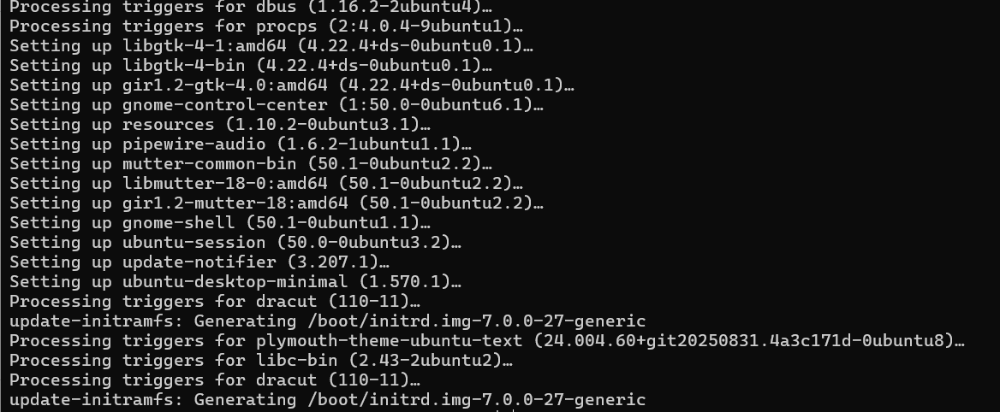

### 7. Hostname Verification

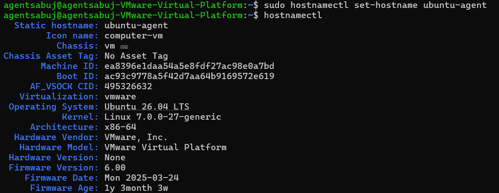

### 8. System Resources

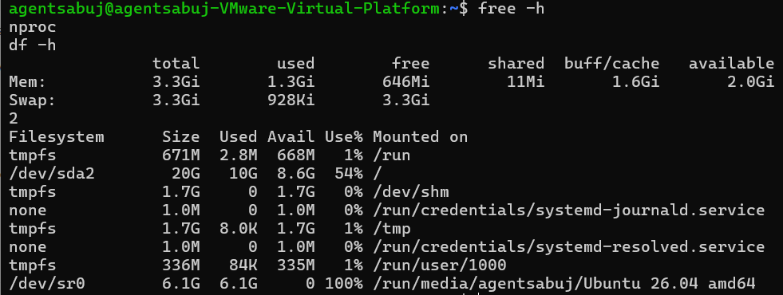

---

## Status

✅ Ubuntu Desktop agent machine prepared successfully.

# Phase 9 – Install and Register Ubuntu Wazuh Agent

## Objective

Deploy a Wazuh Agent on an Ubuntu Desktop virtual machine and register it with the Wazuh Manager using the Wazuh Dashboard deployment wizard.

---

# Environment

- Agent Operating System: Ubuntu Desktop 22.04 LTS
- Architecture: DEB amd64
- Wazuh Manager IP: 192.168.10.132
- Wazuh Version: 4.14.6

---

# Step 1: Open Wazuh Dashboard

Log in to the Wazuh Dashboard.

Navigate to:

```
Wazuh
↓
Agents
```

Click:

```
Deploy new agent
```

### Screenshot

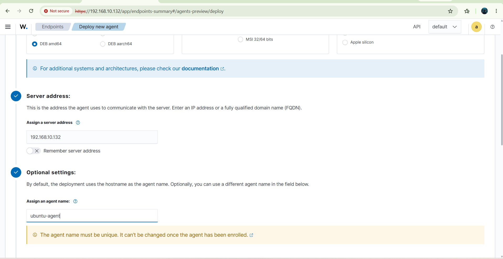

---

# Step 2: Generate Agent Installation Command

Select:

```
DEB amd64
```

Configure:

```
Server Address:
192.168.10.132
```

Click **Next** to generate the installation command.

### Screenshot

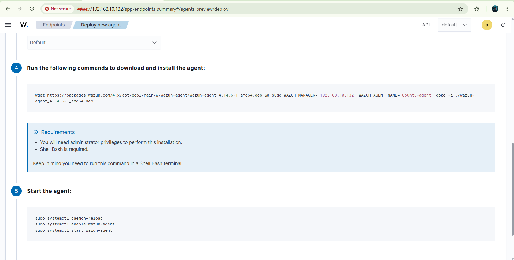

---

# Step 3: Install Wazuh Agent

Copy the generated installation command from the Wazuh Dashboard.

Run the command on the Ubuntu Desktop virtual machine.

The installation downloads and installs the Wazuh Agent automatically.

### Screenshot

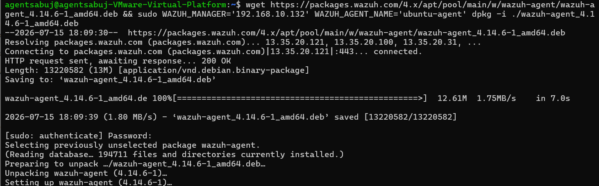

---

# Step 4: Verify Wazuh Agent Service

Verify that the Wazuh Agent service is running.

Command:

```bash
sudo systemctl status wazuh-agent
```

Expected Result:

```
Active: active (running)
```

### Screenshot

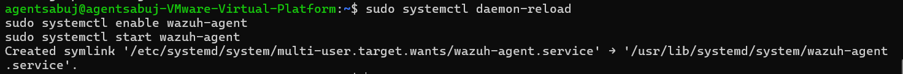

---

# Step 5: Verify Agent Registration

Navigate to:

```
Dashboard
↓
Wazuh
↓
Agents
```

Verify:

- Agent Name
- Status
- Group
- Last Keep Alive

Status:

```
Active
```

### Screenshot

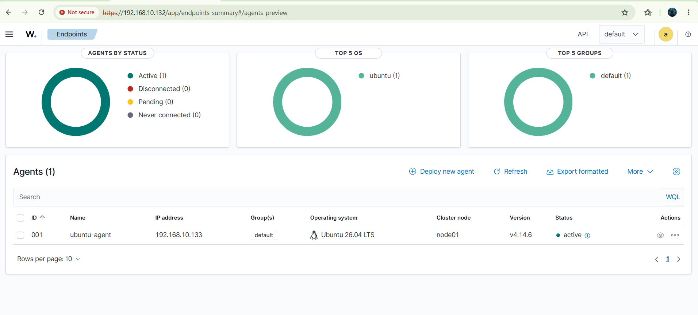

---

# Step 6: Review Agent Details

Open the registered Ubuntu agent.

Verify the following information:

- Operating System
- Wazuh Version
- Group
- IP Address
- Last Keep Alive

### Screenshot

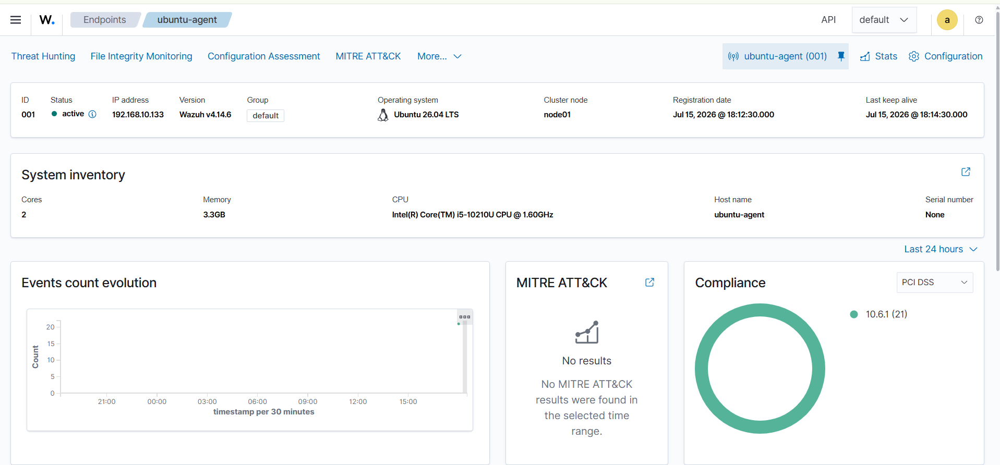

---

# Verification

Command used:

```bash
sudo systemctl status wazuh-agent
```

---

# Result

- Ubuntu Wazuh Agent installed successfully.
- Agent registered with the Wazuh Manager.
- Agent service running successfully.
- Agent connected to the Wazuh Dashboard.
- Communication between the Agent and Manager established successfully.

---

# Status

✅ Completed

# Phase 10 – Ubuntu Agent Security Event Monitoring and Alert Verification

## Objective

The objective of this phase is to verify that the Ubuntu Wazuh Agent can successfully generate security events and that the Wazuh Manager collects, analyzes, and displays those events in the Wazuh Dashboard.

This phase validates the communication between the Ubuntu agent and the Wazuh Manager while demonstrating the detection of authentication events, file integrity monitoring (FIM) events, and sudo command execution.

---

# Lab Environment

| Component | Details |
|-----------|---------|
| SIEM Platform | Wazuh |
| Wazuh Version | 4.14.6 |
| Server OS | Ubuntu Server 22.04 LTS |
| Agent OS | Ubuntu Desktop 22.04 LTS |
| Agent Name | ubuntu-agent |
| Monitoring Types | Authentication Monitoring, File Integrity Monitoring (FIM), Sudo Command Monitoring |

---

# Prerequisites

- Wazuh Manager installed and operational.
- Ubuntu Agent successfully installed.
- Agent registered with the Wazuh Manager.
- Wazuh Dashboard accessible.
- File Integrity Monitoring (Syscheck) enabled.
- Agent connected and active.

---

# Step 1 – Verify Ubuntu Agent Status

Verify that the Ubuntu Wazuh Agent service is running.

### Command

```bash
sudo systemctl status wazuh-agent
```

Expected Output

- Active (running)
- Connected to the Wazuh Manager
- No service errors

### Screenshot

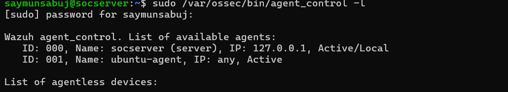

---

# Step 2 – Generate Authentication Event

Generate a failed authentication attempt by entering an incorrect password.

Example:

```bash
su root
```

Enter an incorrect password several times.

The Ubuntu agent monitors authentication logs and forwards them to the Wazuh Manager.

### Screenshot

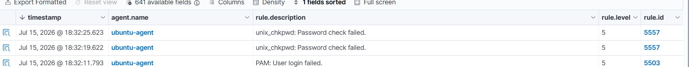

---

# Step 3 – Review Authentication Alert Details

Open:

Dashboard → Security Events

Verify the alert includes:

- Rule ID
- Agent Name
- Source IP
- Username
- Event Time
- Severity Level
- Decoder Information

### Screenshot

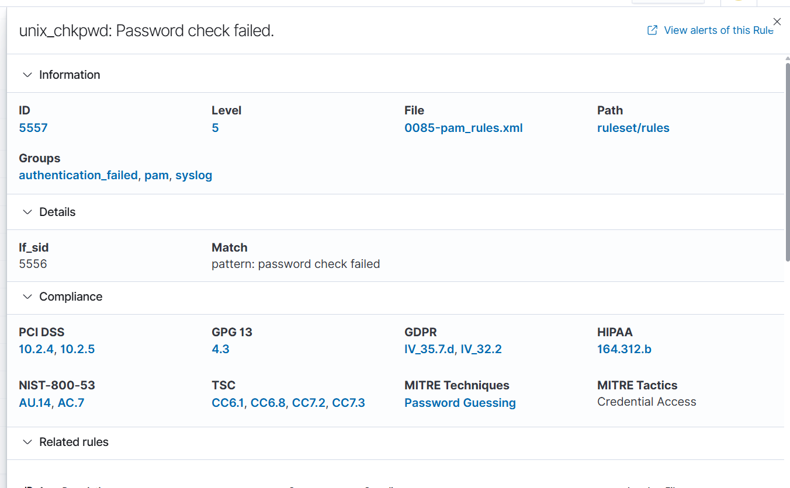

---

# Step 4 – Generate File Integrity Monitoring (FIM) Event

Modify a monitored file.

Example:

```bash
echo "Wazuh FIM Test" >> ~/test.txt
```

or

```bash
nano ~/test.txt
```

Save the file.

Syscheck detects the modification and sends the event to the Wazuh Manager.

### Screenshot

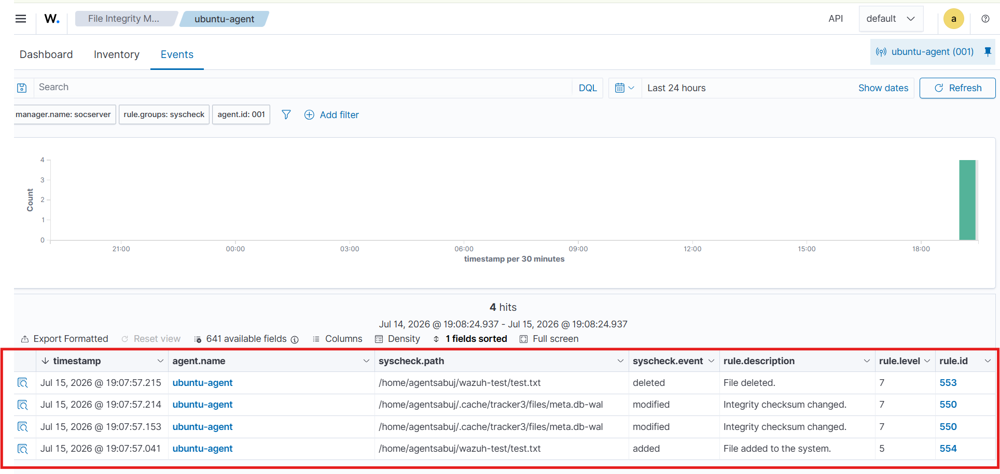

---

# Step 5 – Generate Sudo Event

Execute a privileged command.

Example

```bash
sudo apt update
```

or

```bash
sudo ls /root
```

The Ubuntu Agent forwards the sudo activity to the Wazuh Manager.

### Screenshot

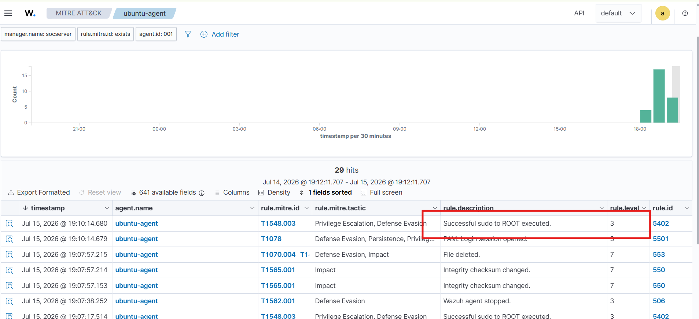

---

# Step 6 – Review Sudo Alert Details

Verify the event contains:

- User
- Host
- Command Executed
- Rule Description
- Severity Level
- Timestamp

### Screenshot

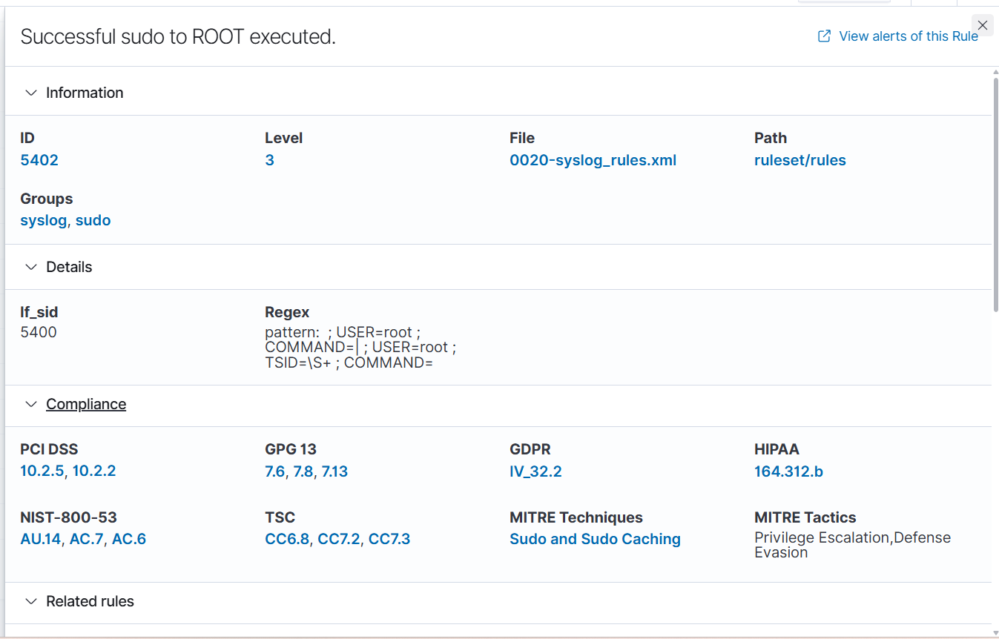

---

# Step 7 – Verify MITRE ATT&CK Mapping

Open the event details.

Confirm that Wazuh automatically maps the detected event to the MITRE ATT&CK framework.

Typical mappings include:

- Initial Access
- Privilege Escalation
- Persistence
- Defense Evasion

### Screenshot

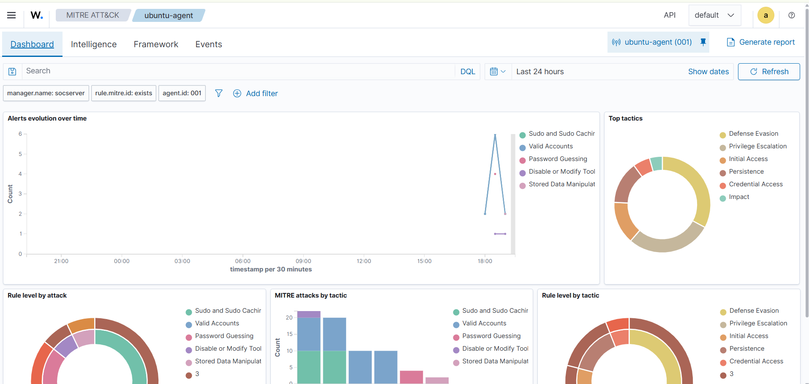

---

# Verification Summary

| Verification | Status |
|--------------|--------|
| Ubuntu Agent Running | ✅ Verified |
| Agent Connected to Manager | ✅ Verified |
| Authentication Alert Generated | ✅ Verified |
| Authentication Alert Received | ✅ Verified |
| FIM Event Generated | ✅ Verified |
| FIM Alert Received | ✅ Verified |
| Sudo Event Generated | ✅ Verified |
| Sudo Alert Received | ✅ Verified |
| MITRE ATT&CK Mapping Verified | ✅ Verified |

---

# Security Events Observed

- Failed Login Detection
- Authentication Monitoring
- File Modification Detection
- Sudo Command Execution
- Security Rule Matching
- MITRE ATT&CK Mapping