# Wazuh SOC Lab Installation Documentation

## Phase 1: GitHub Repository & Project Setup

**Date:** 11 July 2026

---

## Objective

Prepare the development environment and create a GitHub repository for documenting and managing the Wazuh SOC Lab project.

---

## Step 1: Create GitHub Repository

Repository Name:
```
wazuh-soc-lab
```

Visibility:
- Public

Status:
- Completed

---

## Step 2: Install Git

Installed Git for Windows.

Version:

```
git version 2.55.0.windows.2
```

Status:
- Completed

---

## Step 3: Install Visual Studio Code

Installed Visual Studio Code.

Purpose:

- Configuration Editing
- Documentation
- Git Integration

Status:
- Completed

---

## Step 4: Configure Git

Configured Username

```bash
git config --global user.name "Saymun Islam Sabuj"
```

Configured Email

```bash
git config --global user.email "saymunsabuj21766.1@gmail.com"
```

Status:
- Completed

---

## Step 5: Clone GitHub Repository

```bash
git clone https://github.com/saymunsabuj217661-byte/wazuh-soc-lab.git
```

Status:
- Completed

---

## Step 6: Create Project Structure

Created folders:

- agents
- architecture
- configs
- docs
- logs
- rsyslog
- screenshots
- scripts
- wazuh

Status:
- Completed

---

## Step 7: Create README

Created README.md file.

Status:
- Completed

---

## Step 8: Create .gitignore

Created .gitignore file.

Status:
- Completed

---

## Step 9: First Commit

```bash
git add .

git commit -m "Initial project structure"
```

Status:
- Completed

---

## Step 10: Push to GitHub

```bash
git push -u origin main
```

Status:
- Completed

---

## Verification

```bash
git status
```

Output:

```
On branch main

Your branch is up to date with 'origin/main'.

nothing to commit, working tree clean
```

Status:
- Successful

# Phase 2 - Ubuntu Server Preparation

## Objective

Prepare the Ubuntu Server virtual machine for Wazuh SIEM deployment.

## VM Configuration

- Hypervisor: VMware Workstation Pro
- VM Name: soc-server
- Operating System: Ubuntu Server 22.04.5 LTS
- RAM: 8 GB
- CPU: 4 vCPU
- Disk: 100 GB
- Network: NAT

## Static Network Configuration

- Interface: ens33
- IP Address: 192.168.10.132/24
- Gateway: 192.168.10.2
- DNS:
  - 8.8.8.8
  - 1.1.1.1

## Verification

Commands used:

```bash
hostnamectl
ip a
ip route
ping -c 4 8.8.8.8
ping -c 4 google.com
```

## Status

Completed

## Screenshots

### 1. VMware Virtual Machine Configuration

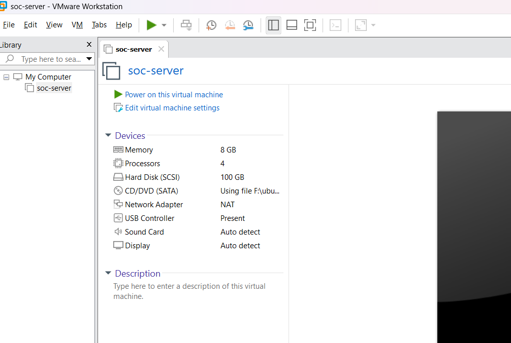

### 2. Network Configuration

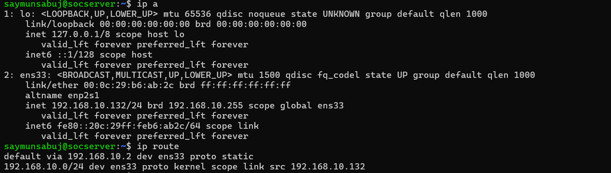

### 3. Connectivity Test

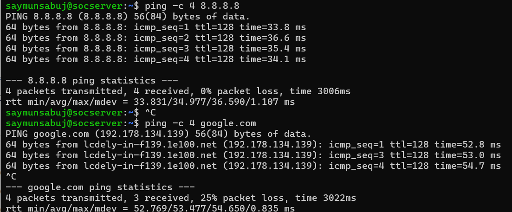

### 4. System Information

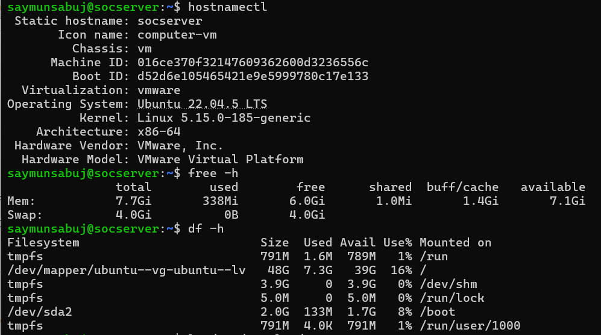


# Phase 3 – Centralized Rsyslog Installation

## Objective

Install and verify the Rsyslog service to prepare the Ubuntu server for centralized log collection.

## Commands

```bash
sudo apt update
sudo apt install rsyslog -y
rsyslogd -v
sudo systemctl status rsyslog
sudo systemctl enable rsyslog
sudo systemctl is-enabled rsyslog
```

## Expected Result

- rsyslog installed successfully.
- Service status: active (running).
- Service enabled at boot.

## Screenshots

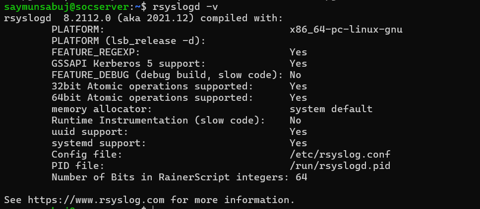

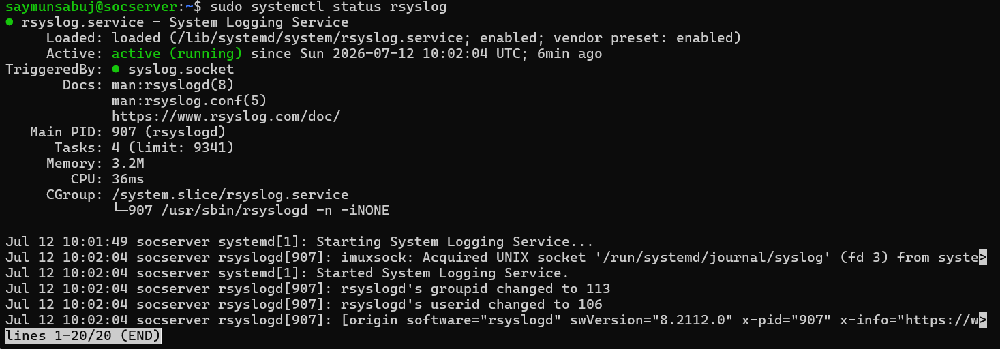


## Step 2: Backup Rsyslog Configuration

Before making any configuration changes, a backup of the original `rsyslog.conf` file was created.

### Command

```bash
sudo cp /etc/rsyslog.conf /etc/rsyslog.conf.backup
ls -l /etc/rsyslog.conf*
```

### Result

- Backup file created successfully.
- Original configuration remains unchanged.
- Backup can be restored if needed.

### Screenshot

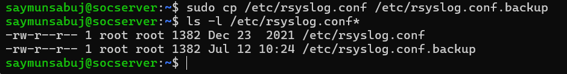

## Step 3: Enable Remote Syslog Reception

The Rsyslog server was configured to receive remote logs using UDP and TCP protocols on port 514.

### Configuration

Enabled modules:

```conf
module(load="imudp")
input(type="imudp" port="514")

module(load="imtcp")
input(type="imtcp" port="514")
```

### Verification

```bash
grep -E "imudp|imtcp|514" /etc/rsyslog.conf

sudo systemctl restart rsyslog

sudo ss -tulnp | grep 514
```

### Expected Result

- UDP port 514 is listening.
- TCP port 514 is listening.
- Rsyslog service is active.

### Screenshots

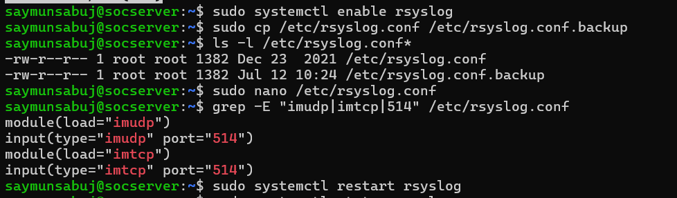

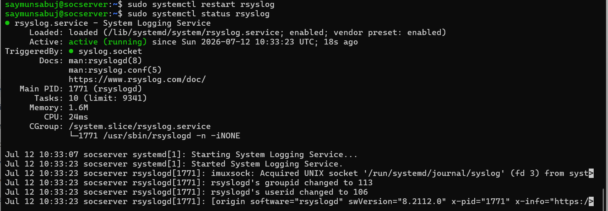

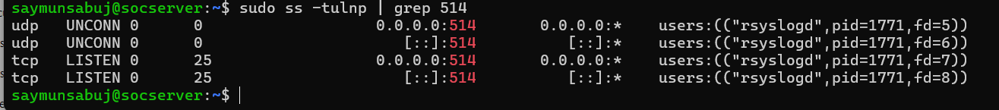
## Step 4: Configure Remote Log Storage

A dedicated directory was created to store logs received by the centralized rsyslog server.

### Create Log Directory

```bash
sudo mkdir -p /var/log/remote
sudo chmod 755 /var/log/remote
```

### Configure Remote Log Template

File:

```bash
/etc/rsyslog.d/remote.conf
```

Configuration:

```conf
$template RemoteLogs,"/var/log/remote/%HOSTNAME%/%PROGRAMNAME%.log"

*.* ?RemoteLogs
& stop
```

### Permission Configuration

```bash
sudo chown -R syslog:adm /var/log/remote
sudo chmod -R 755 /var/log/remote
```

### Verification

```bash
sudo systemctl restart rsyslog

logger "Phase 3 remote log test"

sudo find /var/log/remote -type f
```

### Expected Result

- Rsyslog service running successfully.
- Remote log directory created.
- Logs stored based on hostname and program name.

### Screenshots

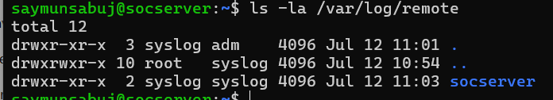

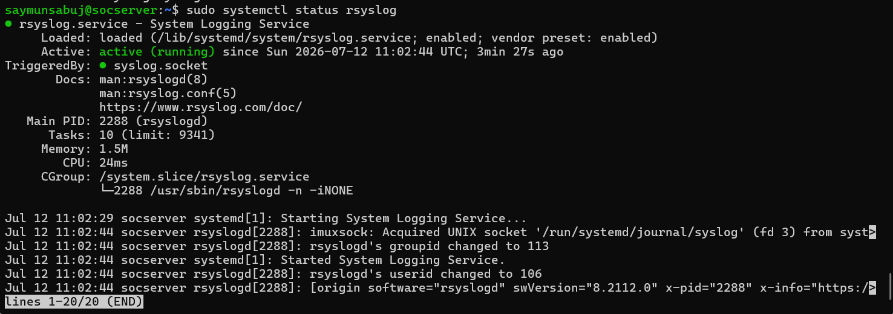

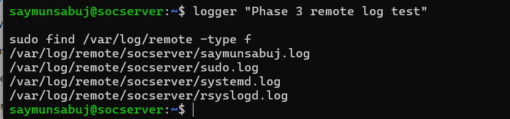


# Phase 4 - Wazuh Installation Preparation

## Objective

Prepare the Ubuntu Server environment before installing the Wazuh components.

---

## Step 1: Verify System Requirements

Before installing Wazuh, verify that the server meets the minimum hardware requirements.

### Commands

```bash
hostnamectl

free -h

nproc

df -h /
```

### Verification

- Operating System: Ubuntu Server 22.04.5 LTS
- Hostname verified.
- RAM: 8 GB
- CPU: 4 vCPU
- Root Filesystem: 97 GB

### Screenshot

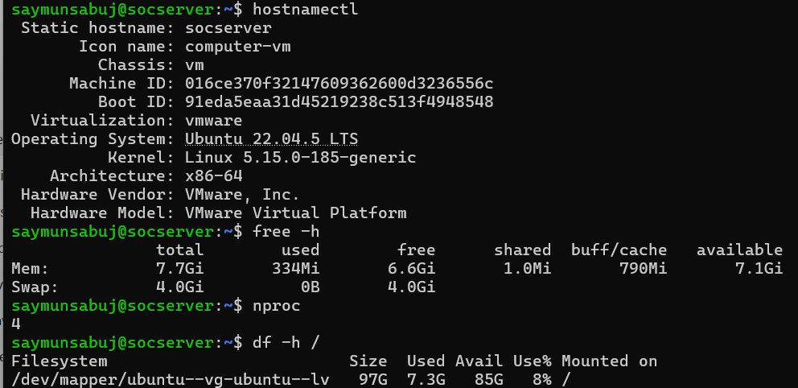

---

## Step 2: Update Ubuntu Packages

Update the package index and ensure the operating system is fully updated.

### Commands

```bash
sudo apt update

sudo apt upgrade -y
```

### Result

- Package index updated successfully.
- No pending package upgrades.

### Screenshot

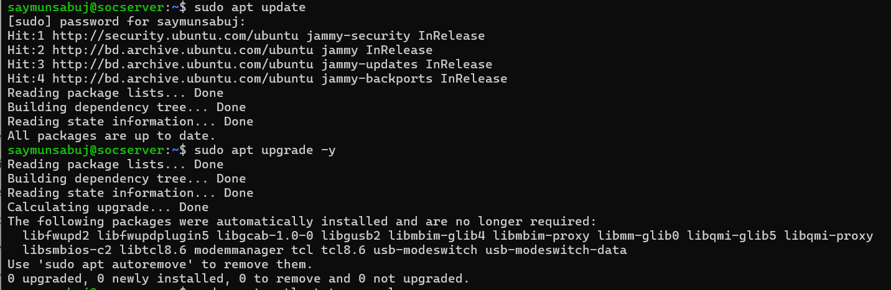

---

## Step 3: Verify Existing Rsyslog Configuration

Since the centralized rsyslog server was configured in Phase 3, verify that the service is still working correctly after the system update.

### Commands

```bash
sudo systemctl status rsyslog

sudo ss -tulnp | grep 514
```

### Expected Result

- rsyslog service is active (running).
- UDP port 514 is listening.
- TCP port 514 is listening.
- Previous rsyslog configuration remains unchanged.

### Screenshot

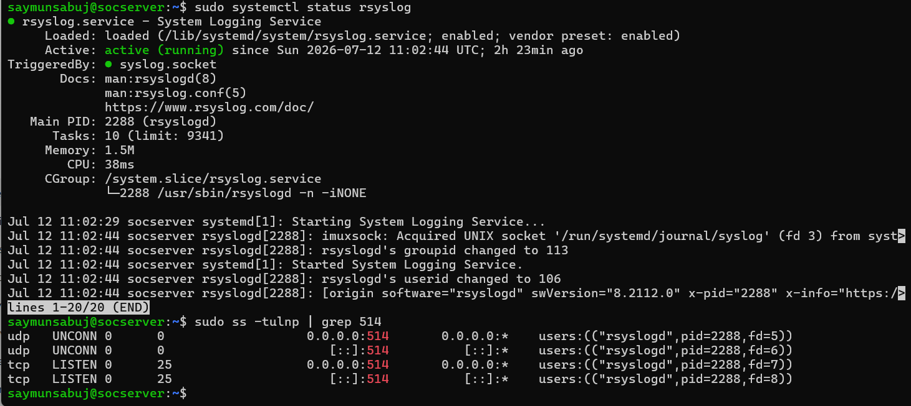

---

## Status

✅ Ubuntu Server is fully prepared for Wazuh installation.

The operating system has been updated successfully and the existing centralized rsyslog configuration remains operational.

# Phase 5 – Download Wazuh Installation Assistant

## Objective

Download and prepare the Wazuh installation assistant for deploying the Wazuh platform.

---

## Step 1: Download the Installation Assistant

### Command

```bash
cd ~

curl -sO https://packages.wazuh.com/4.14/wazuh-install.sh
```

### Result

The Wazuh installation assistant script was downloaded successfully.

### Screenshot

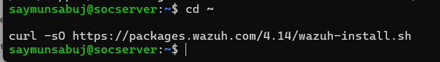

---

## Step 2: Verify Download

### Command

```bash
ls -lh wazuh-install.sh
```

### Result

Verified that the installation script exists.

### Screenshot

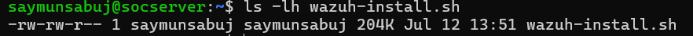

---

## Step 3: Make the Script Executable

### Commands

```bash
chmod +x wazuh-install.sh

ls -l wazuh-install.sh
```

### Result

Execution permission was successfully assigned.

### Screenshot

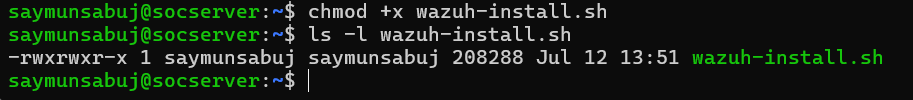

---

## Step 4: Verify the Installation Assistant

### Command

```bash
./wazuh-install.sh --help
```

### Result

The installation assistant displayed the available deployment options successfully.

### Screenshot

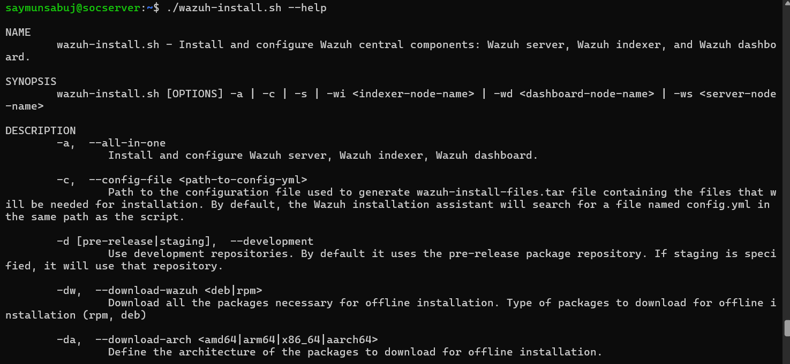

---

## Status

✅ Wazuh Installation Assistant downloaded and verified successfully.

# Phase 6 – Install Wazuh All-in-One

## Objective

Install the Wazuh platform (Indexer, Manager, Filebeat, and Dashboard) on a single Ubuntu Server.

---

## Step 1: Start Installation

### Command

```bash
cd ~

sudo bash ./wazuh-install.sh -a
```

### Result

The Wazuh installation assistant started the automatic deployment process.

### Screenshot

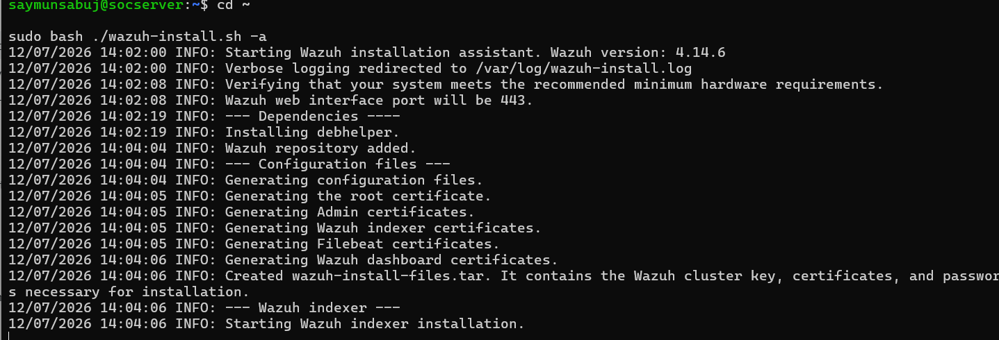

---

## Step 2: Installation Progress

The installation assistant automatically installed:

- Wazuh Indexer
- Wazuh Manager
- Filebeat
- Wazuh Dashboard
- SSL Certificates
- Security Configuration

### Screenshot

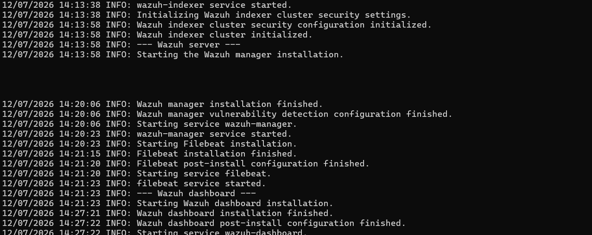

---

## Step 3: Installation Completed

### Result

The installation completed successfully, and the installer displayed the Wazuh Dashboard URL and default administrator credentials.

### Screenshot

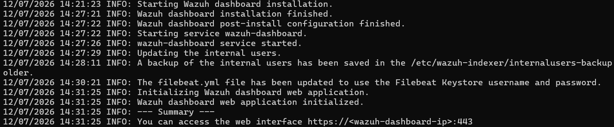

---

## Status

✅ Wazuh platform installed successfully.
# Phase 7 – Verify Wazuh Installation

## Objective

Verify that all Wazuh components were installed successfully and are running properly.

---

## Step 1: Verify Wazuh Manager

### Command

```bash
sudo systemctl status wazuh-manager
```

### Expected Result

- Wazuh Manager service is active (running).

### Screenshot

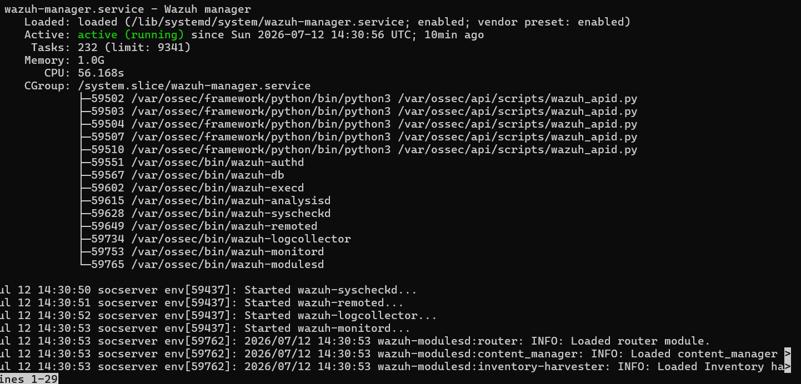

---

## Step 2: Verify Wazuh Indexer

### Command

```bash
sudo systemctl status wazuh-indexer
```

### Expected Result

- Wazuh Indexer service is active (running).

### Screenshot

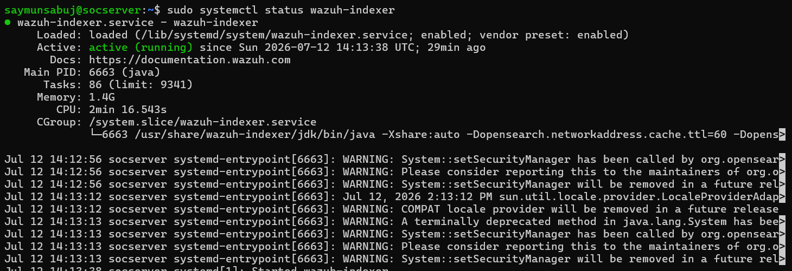

---

## Step 3: Verify Filebeat

### Command

```bash
sudo systemctl status filebeat
```

### Expected Result

- Filebeat service is active (running).

### Screenshot

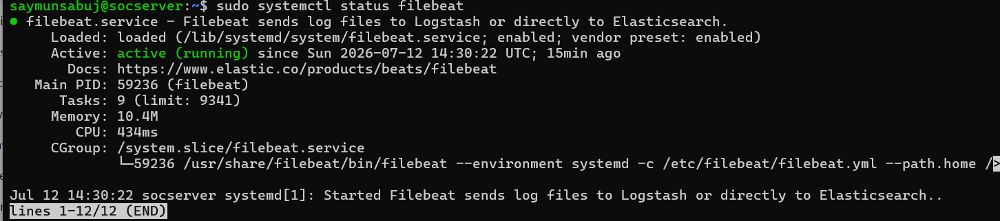

---

## Step 4: Verify Wazuh Dashboard

### Command

```bash
sudo systemctl status wazuh-dashboard
```

### Expected Result

- Wazuh Dashboard service is active (running).

### Screenshot

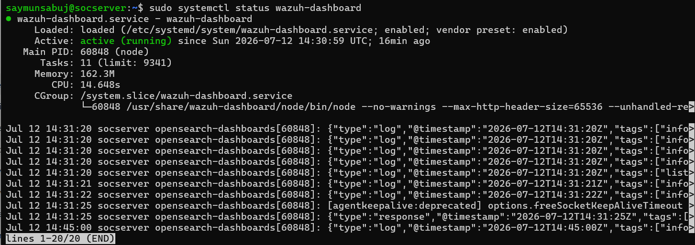

---

## Step 5: Verify Listening Ports

### Command

```bash
sudo ss -tulnp | grep -E '1514|1515|514|55000|9200|443'
```

### Expected Result

The following ports should be listening:

| Port | Service |
|------|---------|
| 514 | Rsyslog |
| 1514 | Wazuh Agent Communication |
| 1515 | Wazuh Agent Registration |
| 55000 | Wazuh API |
| 9200 | Wazuh Indexer |
| 443 | Wazuh Dashboard |

### Screenshot

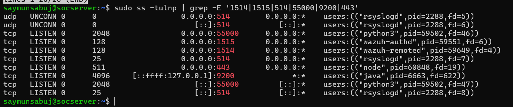

---

## Step 6: Verify Dashboard Login

Open a web browser and access:

```
https://<SERVER-IP>
```

Login using:

- Username: `admin`
- Password: Generated during installation

### Expected Result

The Wazuh Dashboard login page should load successfully.

### Screenshot

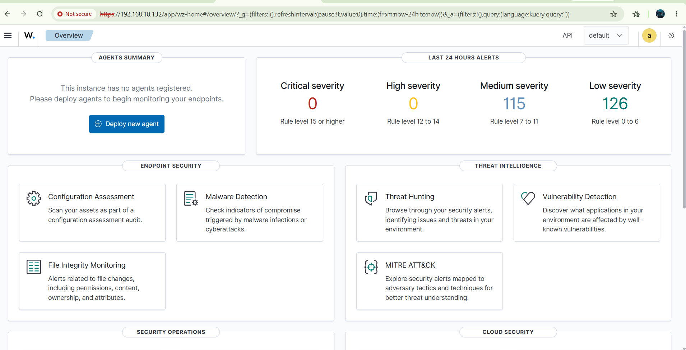

---

## Step 7: Verify Installed Wazuh Services

### Command

```bash
sudo systemctl --type=service | grep wazuh
```

### Expected Result

The installed Wazuh services should be displayed.

### Screenshot

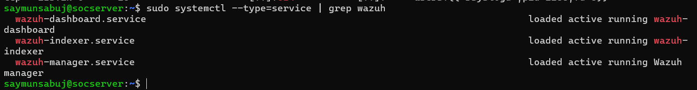

---

## Verification Summary

| Component | Status |
|-----------|--------|
| Wazuh Manager | Running |
| Wazuh Indexer | Running |
| Filebeat | Running |
| Wazuh Dashboard | Running |
| Required Ports | Listening |
| Dashboard Access | Successful |

---

## Status

✅ Wazuh installation verified successfully.