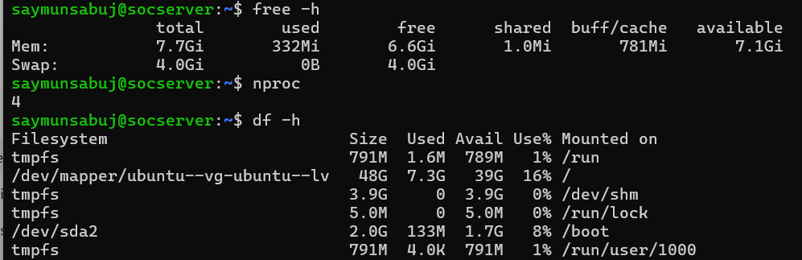
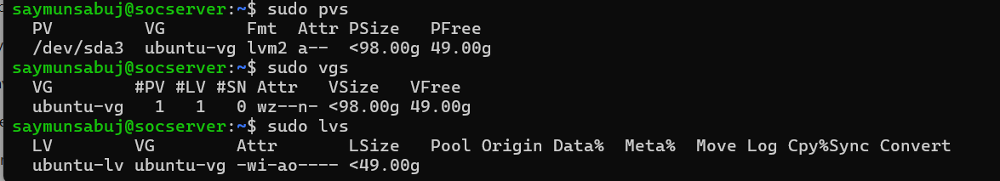
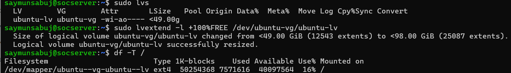
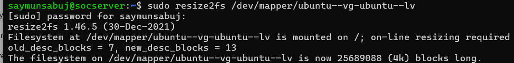
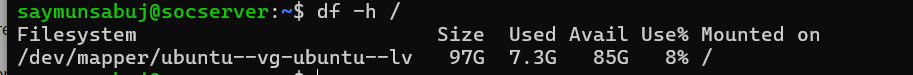

# Wazuh SOC Lab Troubleshooting Documentation

## Issue 01: Ubuntu LVM Disk Expansion Problem

**Date:** 12 July 2026

---

## Problem Description

After creating the Ubuntu Server VM in VMware Workstation Pro with a 100GB virtual disk, Ubuntu root filesystem was showing only around 48GB.

The unused disk space was available in the LVM Volume Group but not allocated to the root logical volume.

---

# Environment

- Hypervisor: VMware Workstation Pro
- Operating System: Ubuntu Server 22.04.5 LTS
- Disk Allocation: 100GB
- Filesystem: ext4
- Storage Management: LVM

---

# Troubleshooting Steps

## Step 1: Check System Resources

Commands:

```bash
free -h
nproc
df -h
```

### Result

System resources were verified successfully.

### Screenshot



---

# Step 2: Check LVM Status

Commands:

```bash
sudo pvs

sudo vgs

sudo lvs
```

### Finding

The Volume Group contained unused space.

Example:

```
VFree: 49.00G
```

Logical Volume size:

```
ubuntu-lv <49.00g
```

### Screenshot



---

# Step 3: Extend Logical Volume

Command:

```bash
sudo lvextend -l +100%FREE /dev/ubuntu-vg/ubuntu-lv
```

### Result

Logical volume was successfully resized.

### Screenshot



---

# Step 4: Resize Filesystem

Command:

```bash
sudo resize2fs /dev/mapper/ubuntu--vg-ubuntu--lv
```

### Result

Filesystem was successfully expanded.

### Screenshot



---

# Step 5: Verify Final Disk Size

Command:

```bash
df -h /
```

### Final Result

Before:

```
48G
```

After:

```
97G
```

The root filesystem successfully used the remaining disk space.

### Screenshot



---

# Root Cause

The VMware virtual disk was correctly configured as 100GB, but Ubuntu LVM did not automatically extend the logical volume during installation.

---

# Solution Summary

The issue was resolved by:

1. Checking available LVM free space.
2. Extending the logical volume.
3. Resizing the ext4 filesystem.
4. Verifying the final disk capacity.

---

# Lessons Learned

- Virtual disk size and filesystem size can be different.
- LVM requires manual expansion after OS installation.
- Disk verification should be completed before deploying applications like Wazuh.

---

# Status

✅ Resolved